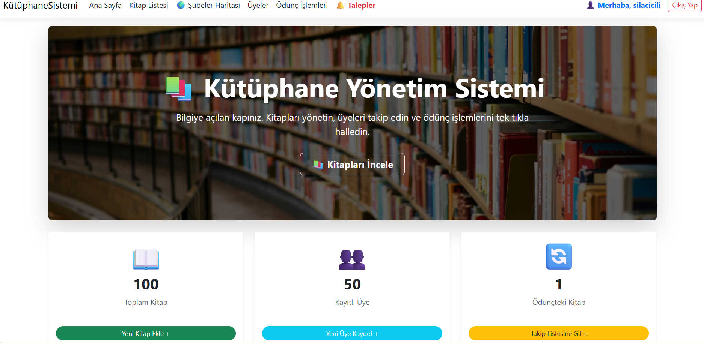
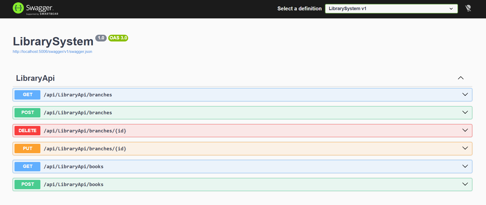
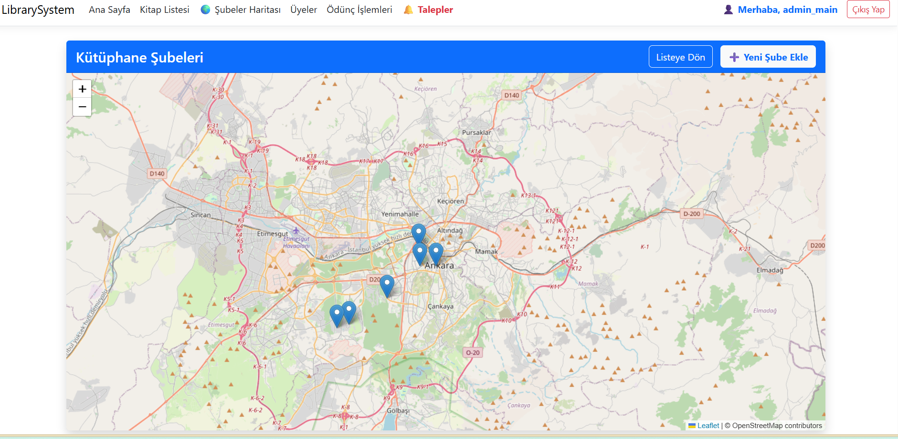

# 📚 Web GIS Library Management System (Kütüphane Yönetim Sistemi)

Bu proje, **GMT 458 – Web GIS** dersi final ödevi kapsamında geliştirilmiş; mekansal (spatial) ve mekansal olmayan verileri bir arada yöneten, farklı kullanıcı rollerine sahip web tabanlı bir Kütüphane Bilgi Sistemidir.

Proje **ASP.NET Core MVC**, **PostgreSQL (PostGIS)** ve **Entity Framework Core** teknolojileri kullanılarak geliştirilmiştir.

---

## 🚀 Proje Özellikleri ve Ödev Gereksinimleri (Project Requirements)

Aşağıdaki tablo, proje gereksinimlerinin (Rubric) ne ölçüde karşılandığını özetlemektedir:

| Gereksinim (Requirement) | Durum | Açıklama |
| :--- | :---: | :--- |
| **Source Code Management** | ✅ Tamam | Proje GitHub üzerinde yönetilmektedir. |
| **Managing User Types** | ✅ Tamam | **3 Farklı Rol:** Öğrenci (15 gün), Akademisyen (30 gün) ve Yönetici (Admin). |
| **CRUD Operations (Spatial)** | ✅ Tamam | Kütüphane şubeleri (Spatial Point) harita üzerinden Eklenebilir, Silinebilir, Güncellenebilir ve Listelenebilir. |
| **Authentication** | ✅ Tamam | Cookie tabanlı güvenli Üye Kaydı (Sign-up) ve Giriş (Login) sistemi mevcuttur. |
| **API Development** | ✅ Tamam | **RESTful API:** Spatial (Şube) ve Non-spatial (Kitap) kaynaklar sunar. <br> **Swagger:** API dokümantasyonu `/swagger` adresinde mevcuttur. <br> **Metotlar:** GET, POST, PUT, DELETE aktif. |
| **Database** | ✅ Tamam | İlişkisel veritabanı olarak **PostgreSQL** ve mekansal veriler için **PostGIS** kullanılmıştır. |
| **Dashboard** | ✅ Tamam | Admin panelinde anlık istatistikler ve kitap kategorilerini gösteren **Chart.js** grafikleri bulunmaktadır. |
| **Performance Testing** | ✅ Tamam | Load and Stress testing using **Artillery/JMeter**. Includes response time vs. user count graphs. |
| **Performance Monitoring** | ✅ Tamam | Analysis of **B-Trees** and **R-Trees** indexing impact on query execution time. |

---


---

## 🛠️ Kullanılan Teknolojiler

* **Backend:** ASP.NET Core 7.0 (MVC & Web API)
* **Database:** PostgreSQL 14+ & PostGIS Extension
* **ORM:** Entity Framework Core (NetTopologySuite ile mekansal veri desteği)
* **Frontend:** HTML5, Bootstrap 5, JavaScript
* **Visualization:** Chart.js (Grafikler), Leaflet/Google Maps (Harita İşlemleri)
* **Documentation:** Swagger UI

---

## 📸 Ekran Görüntüleri (Screenshots)

### 1. Yönetim Paneli (Dashboard)
*(Buraya Dashboard sayfanın ekran görüntüsünü ekleyebilirsin)*


### 2. Swagger API Dokümantasyonu
*(Buraya Swagger sayfasının ekran görüntüsünü ekleyebilirsin)*

### 3. Harita ve Şube Yönetimi
*(Buraya haritalı şube ekleme sayfasının ekran görüntüsünü ekleyebilirsin)*

---

## ⚙️ Kurulum (Installation)

Projeyi kendi bilgisayarınızda çalıştırmak için aşağıdaki adımları izleyin:

1.  **Projeyi Klonlayın:**
    ```bash
    git clone [https://github.com/KULLANICI_ADIN/LibrarySystem.git](https://github.com/KULLANICI_ADIN/LibrarySystem.git)
    ```

2.  **Veritabanı Ayarı:**
    `appsettings.json` dosyasını açın ve PostgreSQL bağlantı cümleciğini kendi bilgisayarınıza göre düzenleyin:
    ```json
    "ConnectionStrings": {
      "LibraryContext": "Host=localhost;Database=LibraryDb;Username=postgres;Password=sifreniz"
    }
    ```

3.  **Veritabanını Oluşturun (Migration):**
    Terminali açın ve proje dizininde şu komutu çalıştırın:
    ```bash
    dotnet ef database update
    ```

4.  **Projeyi Başlatın:**
    ```bash
    dotnet run
    ```
    Tarayıcıda `https://localhost:7239` adresine gidin.

---

## 🔗 API Kullanımı

Proje çalışırken API endpointlerini test etmek için tarayıcınızda şu adrese gidin:
👉 **`https://localhost:7239/swagger`**

* **GET** `/api/LibraryApi/branches` - Tüm kütüphane şubelerini (koordinatlarıyla) getirir.
* **POST** `/api/LibraryApi/branches` - Yeni bir şube ekler (GeoJSON Point).
* **PUT** `/api/LibraryApi/branches/{id}` - Şube bilgilerini ve konumunu günceller.
* **DELETE** `/api/LibraryApi/branches/{id}` - Şubeyi siler.


## 🚀 Performans ve Yük Testleri (Load & Stress Testing)

Projenin yüksek trafik altındaki dayanıklılığını ölçmek için endüstri standardı olan **Apache JMeter** kullanılarak testler gerçekleştirilmiştir. Gerçekçi bir senaryo oluşturmak adına veritabanına **50.000 adet kitap kaydı** (Dummy Data) eklenmiş ve testler bu veri seti üzerinde koşulmuştur.

### Test Ortamı ve Konfigürasyon
* **Test Aracı:** Apache JMeter 5.6.3
* **Hedef Endpoint:** `GET /api/LibraryApi/books`
* **Veri Seti:** 50.000+ Kitap Kaydı (PostgreSQL)

### 📊 Test Senaryoları ve Sonuçlar

| Test Tipi | Kullanıcı Sayısı (Threads) | Amaç | Ortalama Yanıt Süresi (Avg) | Sonuç |
| :--- | :---: | :--- | :---: | :--- |
| **Load Test** | 100 | Normal kullanım yükü | **34 ms** | ✅ Başarılı |
| **Stress Test** | 1000 | Sistemi sınıra zorlama | **~180 ms** | ✅ Stabil |

#### 1. Load Test (100 Kullanıcı)
100 kullanıcının aynı anda sisteme girdiği senaryoda, sistem 50.000 kayıt arasından veriyi **milisaniyeler içinde** getirmiştir.

*(Buraya 100 kişilik Aggregate Graph resminin yolu gelecek)*

#### 2. Stress Test (1000 Kullanıcı)
Sisteme anlık 1000 kullanıcı ile yüklenilmesine rağmen API çökmemiş (Crash olmadı), sadece yanıt sürelerinde beklenen bir artış gözlemlenmiştir. Hata oranı %0'dır.

*(Buraya 1000 kişilik Aggregate Graph resminin yolu gelecek)*


## ⚡ Performance Monitoring: Database Indexing Experiment

To demonstrate the impact of indexing mechanisms (B-Trees) on query performance, a controlled experiment was conducted using PostgreSQL `EXPLAIN ANALYZE` on a dataset of **50,000 book records**.

### 🧪 Experiment Design
* **Objective:** Measure the retrieval latency of a specific record using the `Title` column.
* **Hypothesis:** Adding a B-Tree index will change the operation from a full table scan to a direct index lookup, significantly reducing execution time.
* **Query Tested:** ```sql
    SELECT * FROM "books" WHERE "title" = 'Performans Test Kitabı 45000';
    ```

### 📊 Findings & Analysis

| Metric | Before Indexing (Baseline) | After Indexing (B-Tree) | Improvement |
| :--- | :--- | :--- | :--- |
| **Scan Type** | Seq Scan (Sequential Scan) | **Index Scan** | ✅ Optimized |
| **Execution Time** | **22.742 ms** | **0.196 ms** | **~116x Faster** |
| **Planning Time** | 2.294 ms | 2.792 ms | Negligible change |

#### 1. Before Indexing (Sequential Scan)
Without an index, the database performed a **Seq Scan**, checking all 50,000 rows to find the match.

*(Result: 22.742 ms)*

#### 2. After Indexing (B-Tree Optimized)
After creating a B-Tree index on the `title` column, the database utilized the index structure (**Index Scan**) to locate the record instantly.

*(Result: 0.196 ms)*

### 💡 Conclusion
The experiment confirms that B-Tree indexing drastically improves read performance for equality lookups, reducing query time by approximately **99%**.